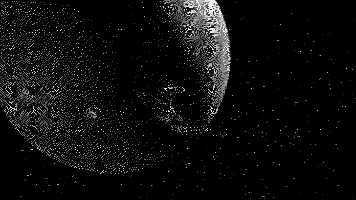

# dith



<sub>([pre-dithering](images/sphere_smol.png))</sub>

Teeny tiny [Floyd-Steinberg dithering](https://en.wikipedia.org/wiki/Floyd%E2%80%93Steinberg_dithering).

## Installation

```console
cargo install --git https://github.com/koenwestendorp/dith
```

## Dependencies

Depends on the [`image`](https://crates.io/crates/image) crate for decoding and encoding many formats.

---

Do with it what you want, as long as it's cool things :)

By [Ma3ke](https://hachyderm.io/@ma3ke).
Implemented on a bus ride at the end of September 2023.
